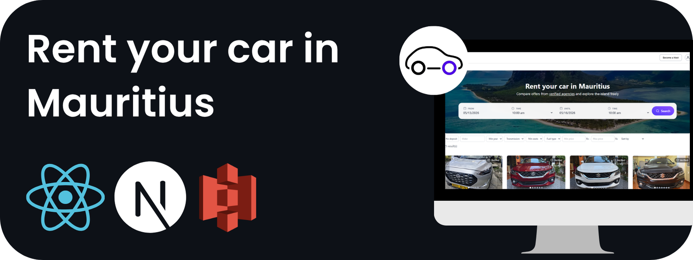
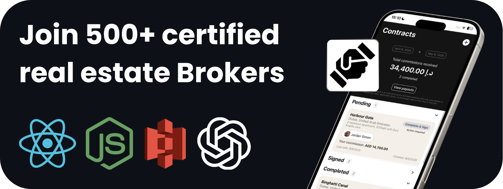

Hi there 👋 I'm James

---

## 🚀 About Me

I'm a software engineer passionate about building products from idea → production.
Recently, I've been building marketplaces, AI workflows, and GPU/compute-related products.

---

## 🔭 Current Focus

- Building **Allo**, an optimization layer for San Francisco Compute that automatically adapts your procurement strategy to market conditions and your deployments to your workloads' needs.
- Exploring GPU infrastructure

---

## 🛠️ Tech Stack

### Languages

### Frontend & Mobile

### Backend

### Databases & Cloud

### AI & Data

### Tools & Infrastructure

### Currently Learning

---
## Recent Projects

---

## 📫 Contact

- 📧 James.Vanhecke@hotmail.com
- 💼 LinkedIn: www.linkedin.com/in/james-vanhecke/

---

## ⚡ Fun Fact

I once built and managed my own GPU mining rig using 10 RTX 3070s — which also became my local AI/deep learning playground 😄

---
